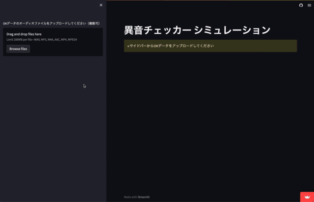
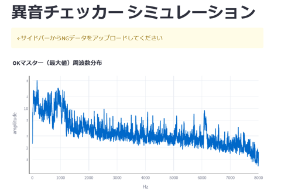
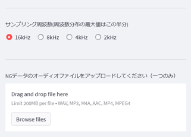
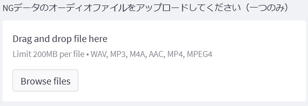
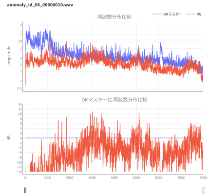
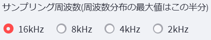
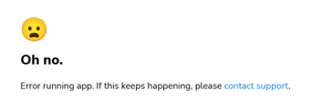

# 異音チェッカー シミュレーション
OKオーディオファイルからマスターを作り、NGオーディオファイルと比較します。これにより、NT-100での異音判定可能か確認できます。

|  |
| ---- |

## 使用手順
### OKオーディオファイルのアップロード
- サイドバーに**OKファイル**のアップロードウィジェットが表示されます。**OKファイル**は複数選択可能です。**OKファイル**をドラッグするかボタンを押してファイルを選択してください。

  |  |
  | ---- |

- OKファイル・NGファイルとも、すべてのオーディオファイルのサンプリングレートは同一である必要があります。
  異なる場合、正常な結果をえられません。
- ファイルのアップロードが終わると自動でFFTが実行され、最大値の周波数分布から**OKマスター**が作成されます。

  |  |
  | ---- |

- **OKマスター**が作成されると、サイドバーに以下がが表示されます。
  - **サンプリング周波数**の選択ウィジェット
  - **NGファイル**のアップロードウィジェット

  |  |
  | ---- |

### NGオーディオファイルのアップロード

|  |
| ---- |

**NGファイル**を一つアップロードしてください。ファイルのアップロードが終わると自動でFFTが実行され、以下がが表示されます。
- **OKマスター**と**NGファイル**の周波数分布グラフ（対数軸）
- **NGファイル**の周波数分布を**OKマスター**の値で割ったグラフ（dB軸）

|  |
| ---- |

dB と 比率の関係は以下です。OKとNGで 6dB（2倍）以上の差があることが望ましいです。

| デシベル（dB） | 振幅比   | デシベル（dB） | 振幅比  |
|-------------:|:--------|-------------:|:-------|
| -6.00 dB     | 0.50 倍 | 8.00 dB      | 2.51 倍 |
| -4.00 dB     | 0.63 倍 | 10.00 dB     | 3.16 倍 |
| -2.00 dB     | 0.79 倍 | 12.00 dB     | 3.98 倍 |
| 0.00 dB      | 1.00 倍 | 14.00 dB     | 5.01 倍 |
| 2.00 dB      | 1.26 倍 | 16.00 dB     | 6.31 倍 |
| 4.00 dB      | 1.58 倍 | 18.00 dB     | 7.94 倍 |
| 6.00 dB      | 2.00 倍 | 20.00 dB     | 10.00 倍|

### サンプリング周波数の変更

|  |
| ---- |

データのダウンサンプリング（デシメーション）により周波数を変更します。元のファイルの周波数が最大となります。  
FFT結果の最大周波数が低くなりますが、データ数（4097）は不変なので、精度が向上します。

## Streamlit の実行制限
アプリは Streamlit で実行されます。CPU・メモリについて1日あたりの制限があり、上限に達するとエラーが表示されます。
その場合は次の日に制限が解除されるまでお待ちください。

|  |
| ---- |

## 注意事項（将来的にはプログラムで判定して表示したい）
- オーディオファイルの値が一カ所でも1に到達しているとFFTの結果が利用できない
  - **対処** 計測ゲインを下げる
- オーディオファイルの最大値が0.1に到達していなければ、ダイナミックレンジの不足が疑われる
  - **対処** 計測ゲインを上げる
